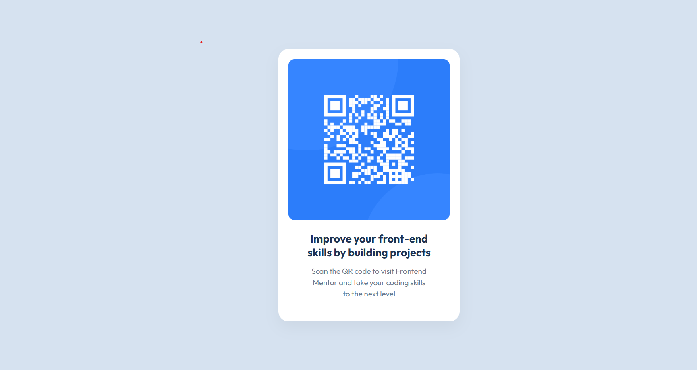

# Frontend Mentor - QR code component solution
This is a solution to the QR code component challenge on Frontend Mentor. Frontend Mentor challenges help you improve your coding skills by building realistic projects.

## Table of contents
- [Overview](#overview)
  - [Screenshot](#screenshot)
  - [Links](#links)
- [My process](#my-process)
  - [Built with](#built-with)
  - [What I learned](#what-i-learned)
  - [Continued development](#continued-development)
  - [Useful resources](#useful-resources)
- [Author](#author)
- [Acknowledgments](#acknowledgments)

## Overview

### Screenshot
Add a screenshot of the final project output here (card with QR code on background)

### Links
- Solution URL: Add solution URL here
- Live Site URL: Add live site URL here

## My process

### Built with

- Semantic HTML5
- CSS (custom properties)
- Flexbox
- Mobile-first workflow
- Responsive design for:
- Mobile width: 375px
- Desktop width: 1440px
- Google Fonts – Outfit (weights 400 & 700)

### What I learned
This project helped me practice:

- Creating centered layouts using Flexbox
- Managing consistent spacing with padding and margin
- Making text flow responsively using line-breaks
- Applying mobile-first design principles
- Using font and color guidelines provided by a design spec
- Writing clean and maintainable CSS

Here’s a snippet I used to manage line-break control for the paragraph:

p {
  max-width: 250px;
  text-align: center;
  line-height: 1.4;
  word-break: break-word;
}

### Continued development

Going forward, I’d like to:

- Improve my skills in responsive typography
- Experiment with utility-first CSS frameworks like Tailwind CSS
- Learn how to implement accessibility (WCAG) standards more rigorously

### Useful resources

Frontend Mentor Help Center – Great resource to clarify how to approach these projects.[https://www.frontendmentor.io]
CSS Flexbox Guide - MDN – Helped me understand centering content vertically and horizontally.[https://developer.mozilla.org/en-US/docs/Web/CSS/CSS_flexible_box_layout/Basic_concepts_of_flexbox]

## Author

GitHub - @justshreeya
Frontend Mentor - @justshreeya